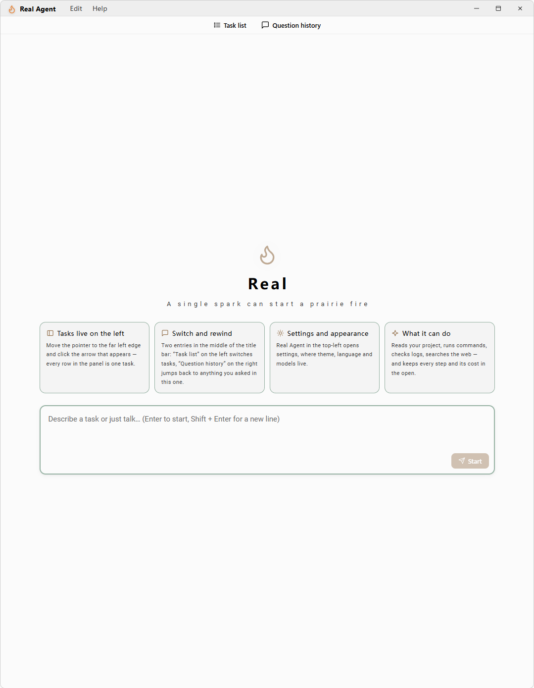
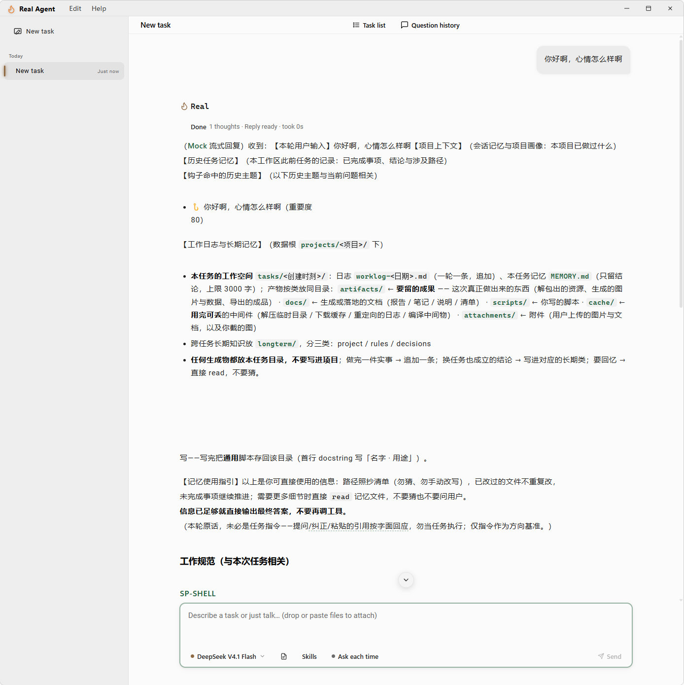
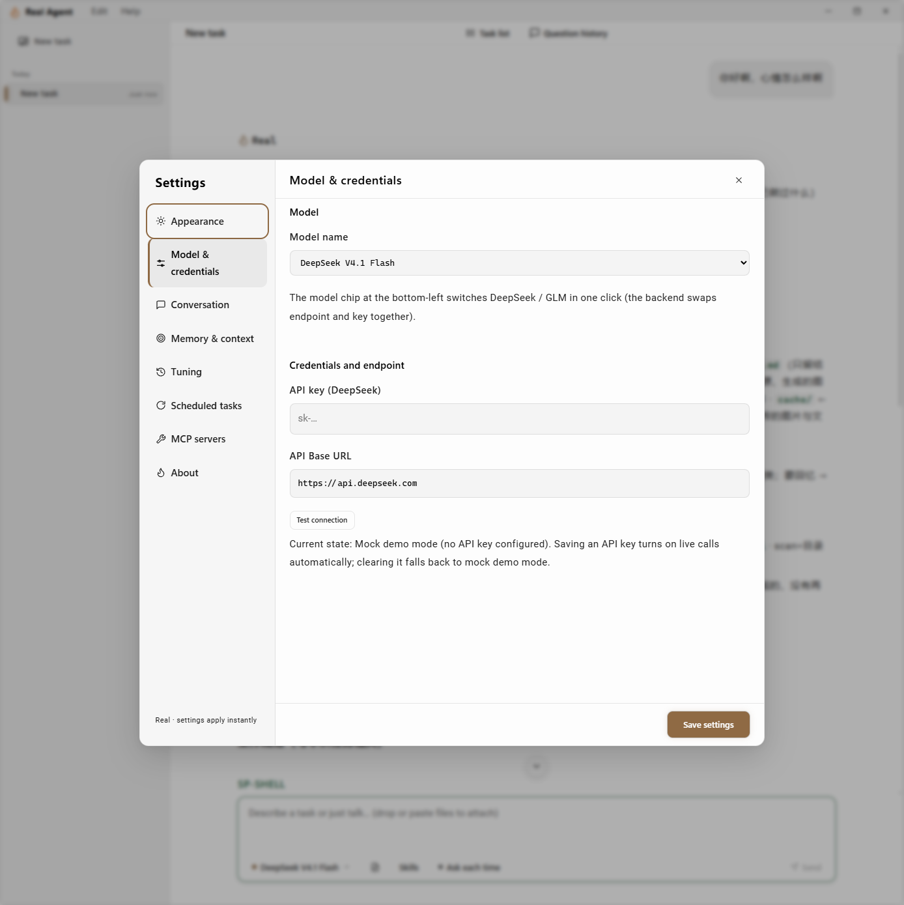
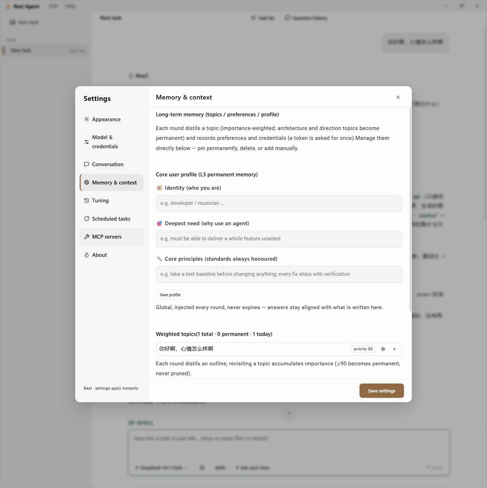

# Real

> 让 AI 真正干活的本地 Agent 工作台 —— 确定性收敛循环 · 四件套工具面 · 编制化话术 · 全程可审计

```
决策 → 执行 → 回执进流 → 再决策 …… 纯文本即收敛交付
```

模型在这里不是「聊天」，而是在一个**一轮一轮收敛**的循环里推进任务：
每轮把当前上下文交给模型表态 —— 它发工具调用就执行、把回执带进下一轮；
它给出纯文本，那就是答案，循环结束。每一轮都留证据、每一轮都可追溯。

后端 Rust（Axum + SQLx + SQLite），桌面壳 Tauri 2 + React 18。
**全部状态落库、每轮可追溯、每次改动有对照。**

MIT License · 测试全绿 · Windows 完整验证

> **平台现状**：后端与桌面壳在 Windows 上完整验证。代码含 `cfg(unix)` / `cfg(target_os = "macos")`
> 分支，但命令通道（cmd / PowerShell 分派、`dir` / `findstr` / `Select-Object` / `.bat`）
> 是 Windows 语义，其测试以 `#![cfg(windows)]` 门住。macOS / Linux 上可编译，属**未验证**状态 ——
> 我们选择如实标注，而不是声称一个没跑过的支持矩阵。

> **English readers** → [README.en.md](docs/README.en.md) · [INSTALL.en.md](docs/INSTALL.en.md)
> （本中文版是权威文档，含完整机制与架构说明；英文版是面向国际读者的概览）

---

## 目录

- [它是什么](#它是什么)
- [我为什么做它](#我为什么做它)
- [三条设计取向](#三条设计取向)
- [核心机制](#核心机制)
- [架构](#架构)
- [快速开始](#快速开始)
- [HTTP 接口](#http-接口)
- [数据落点](#数据落点)
- [测试](#测试)
- [参与贡献](#参与贡献)
- [还没做完的部分](#还没做完的部分)
- [关于我](#关于我)
- [许可证](#许可证)

---

## 它是什么

一个**本地优先**的 AI Agent 工作台。你给它一个项目根和一句话需求，它在那个根里干活：

- 读代码、改代码、跑命令、留日志
- 每轮结束自报「这一轮改了什么、多了哪些字节」
- 越界操作走确认门
- 上下文超出预算前自动归档，不静默丢东西

它不做的事：不云同步、不多租户、不替你决定工作目录。



---

## 我为什么做它

我是做音乐的 —— 编曲、制作。

写 Real 的念头来自一件很具体的事：我想给编曲加一个能听懂人话的 AI 助手。
我说「给这段吉他加一段鼓」，它就加；我说「照这个旋律补一条贝斯」，它就补。
说得出，就做得到。

为这件事我开始写一个音乐工作站。写着写着停下来：
我真正缺的不是一个更聪明的助手，而是一个**自己的、可控的、不裸奔的** Agent 平台 ——
它得在我自己的机器上跑，读我自己的文件，每一轮都留得下痕迹、退得回原样。

2026 年 5 月底，我开始搭 Real。四个月后，它长成了现在这样。

**这几万行代码，我一个字都没有手写。**

我不是程序员，用的是另一套东西：边界划在哪、谁归谁管、什么该留下、什么该删掉。
Real 是我把这种想法变成能跑起来的东西的方式。

所以 Real 对我不是终点，是手段 —— 我要做的是那个音乐软件，
而它需要一个安全、自主、能长期演化的开发底座。**先造工具，再造产品。**

这也是它开源的原因。这类东西不是"写完就完、一年打个补丁"的软件，
它是跟人打交道的，只不过这个"人"是模型：有幻觉、有不确定性、还在演化 ——
**这是个长期工程。** 一个人做不完，多一双眼睛就少一个坑。

---

## 三条设计取向

这三条决定了 Real 的样子。改任何一处之前，请先理解它们。

### 一、工具面只留四件套

```
read · write · modify · run
```

工具面是**每次请求的最前段**，是前缀里最贵的一块。工具越多，模型每轮还要多做一次
「该用哪个」的选择。所以按**能力**收敛到四条：读写改 + 万能命令通道。

被裁掉的 `search` / `ask` / `web_search` **实现全部保留**，只是不挂进工具面：

| 裁掉 | 能力去哪 |
|---|---|
| `search` | 并入 `run`（`grep -rn` 走原生壳） |
| `ask` | 由正文提问承担（不确定就问一句，不用选项菜单） |
| `web_search` | 并入 `run` + `curl` |

> 加回任何一个都必须同步 `mcp/registry_tests.rs` 的工具名单断言 —— 那是工具面的**对外契约**，不是注释。

### 二、话术当代码管（编制化）

提示词不散落在各处，而是**按部门编制**，每个文件一个职责、一个注入点、一个时机。
全部走 `include_str!` 编译期嵌入 —— 改 `.md` 不重编译，改动不生效。

| 文件 | 段 | 管什么 | 时机 |
|---|---|---|---|
| `workflow/system.md` | `#persona` | 人格与执行纪律 | 每轮常驻·最前 |
| `workflow/output_discipline.md` | `#output_discipline` | 语言纪律、思考骨架与思考纪律 | 每轮常驻 |
| `workflow/narration.md` | `#narration` | 旁白形态 | 每轮常驻 |
| `workflow/journal.md` | `#journal` | 留痕纪律 | 每轮常驻 |
| `workflow/round_frame.md` | `#frame` · `#memory` | 通道与预算 + 目标槽位 · 记忆包装框 | 每任务一次 |
| `workflow/mirror.md` | `#action` `#progress` `#attribution` `#terminate` | 触发式对账与归因 | 触发式 |
| `tools/{read,write,modify,run}.md` | — | 在册的四个工具**怎么填参** | 工具 schema |
| `tools/reason_instruction.md` | — | 工具行标题（`reason` 字段）的教学文案 | 注入进每个工具 |
| `tools/spill_note.md` | — | 超长输出落盘规则（多工具共用） | 随工具 |
| `reason` 字段 schema | — | 参数边界——**声明了 `min`/`max` 的必须写进 description** | 每个工具 |

排在前四的 `persona → output_discipline → narration → journal` 拼成**固定系统前缀**
（`agent/context.rs::CONVERGENT_SYSTEM_PROMPT`）—— 顺序即缓存，永不重排。

配套四条铁律（原文见 `server/prompts/README.md` §二）：

1. **改话术不改逻辑，改逻辑不改话术。** 行为调优去 `.md`，执行链路去 `.rs`。两边一起动必出事。
2. **话术变更视同代码变更。** 改完必须 `cargo check` + 提交 —— `include_str!` 是编译期嵌入。
3. **前缀缓存三律**：静态模板在前、动态值在后；条款顺序一旦稳定**永不重排**；同场景措辞零变体。
4. **每条契约一个职责，且只住一个文件。** 同一条纪律写两处 = 模型读两遍，既费 token 又互相稀释。

### 三、工作知识按需注入

「怎么写这个工具」（参数、返回值、边界）住 `tools/`，进固定前缀 —— 每次请求都要发。

「怎么干活」（检索策略、判结束信号、改动次序、编码坑）住 `specs/rules/`，
**按关键词命中才注入**，预算 2400 字符。现有 19 条规范，一个触发词都没命中的任务
由 `BASELINE` 兜底注入 `SP-SHELL` + `SP-LOCATE`。

> 判据：**搬家本身不省**（固定前缀与命中槽都是「每轮都发」）。
> 省的是「没命中就不注入」。所以 `specs/` 只放**窄触发**的知识 ——
> 几乎每个任务都要用的（如工具通道选择）应住 persona 常驻槽。
> **真正白赚的只有两类：删重复、删模型已知。**

---

## 核心机制

一次真实任务进行中的样子 —— 用户提问、模型旁白、工具调用，以及被注入的工作规范：



### 收敛循环

任务不是「问一句答一句」，而是**一轮一轮收敛**。每轮只做一件事：
把当前上下文交给模型表态，再按它的表态分相处理。

```
一轮 = 决策相（上下文 → 模型表态，≤1 次 LLM 调用）
         ├─ 有工具调用 → 执行相：执行 + 回执进流 → 进入下一轮
         └─ 纯文本回答 → 收敛相：这就是答案，循环结束
```

循环在四种情况下停：模型自己收敛（纯文本）、达到轮次上限（默认 100，`REAL_MAX_ROUNDS`）、
用户取消、或撞上停滞止损。轮次上限属**非收敛终止** —— 后端照实记成未完成，
不判定工作质量。

### 停滞止损

后端按**进展**记账：改文件成功 = 实体进展；首读新文件 / 换新命令成功 = 探索进展；
复读旧文件与重跑同命令**不算进展**。连续零进展按档位升级：

| 档位 | 默认 | 动作 |
|---|---|---|
| 唤醒 | 4 轮 | 注入「停滞唤醒」——必须换策略或向用户提问 |
| 收窄 | 8 轮 | 进入只读收窄——只能交收束总结或提问 |
| 停机 | 12 轮 | 收束停机交付；用户回「继续」即带断点续跑 |
| 纯诊断兜底 | 30 轮 | 全程一个文件都没改过 ⇒ 按"只诊断"看待，到时收口 |
| 总门限 | 20 轮 | **轮数不足 20 不判停机** —— 长任务的开头不该被误杀 |

停机只对「曾改过文件」的任务生效；一次都没改过的任务走纯诊断兜底那条。
参数可由环境变量 `REAL_STALL_*` 覆盖（`WARN` / `NARROW` / `STOP` / `DRY` / `MIN`）。

### 「改了没有」不由模型自己申报

两层都写死，缺一层就有空子。

**第一层 · 后端自己扫**（`server/src/wt.rs`）—— 模型说「改好了」不算数。
每轮扫一遍工作区，按 mtime 找出**自某道标记以来被写过的源文件**，新→旧最多列 12 条。
这个清单不由模型计算，也不由模型解释。它喂三处：

| 用途 | 干什么 |
|---|---|
| 触发自动验证 | 这一轮有写入 ⇒ 该跑一次验证（`tools/verify.rs::plan_for`） |
| 卡壳反射 | 轮数 ≥ 8 且**本轮无任何写入证据** ⇒ 注入对账事实（只反射，不判定、不强停） |
| 改动清单 | 并入给模型看的「这轮改了哪些文件」（含经 `run` / 脚本改的） |

扫描有硬顶：单次最多访问 20,000 个条目，超限判「扫不出」而不是硬扛；
判不出时该会话标记为不可用并跳过后续扫描 —— **不假装有数据**。

**第二层 · 人格里的自证纪律**（`prompts/workflow/system.md` §外部裁判）—— 要求模型每轮跑一次
`git status --porcelain` 与 `git diff --stat`，把**实数原样**贴进回复；**连续两轮该数字为空
⇒ 判定为亏**，无论叙事多漂亮。注意这条是**写给模型的**（提示词层），不是后端在跑 git。

### 上下文与成本治理

- **热 / 冷闸门**：热会话一字不改；冷会话或越线才压缩。
- **读缓存**：首次读落的「指纹 + 符号骨架」存入记忆，跨任务指纹一致时定向提示，变更自动刷新。
- **spill 归档**：超长工具输出落盘归档、上下文只留引用；真会话保留 7 天、孤儿 1 天。
- **会话退场**：静默满阈值的会话自动摘要或清除，由后台定时器续跑。

### 证据链

| 表 / 目录 | 存什么 |
|---|---|
| `sessions` / `events` | 每轮事件流（SSE 实时推送 + 落库回放） |
| `turn_logs` | 每轮计量与结果 |
| `memories` | 长期记忆、工作日志、读缓存骨架 |
| `scheduled_jobs` | 定时触发 |
| spill 目录 | 超长工具输出的全文归挡 |

---

## 架构

```
Real/
├── server/                    Rust 后端
│   ├── src/
│   │   ├── agent/             收敛循环 · 上下文装配 · 历史治理 · 记忆
│   │   │   ├── orchestration/   workflow.rs —— 收敛循环与上下文装配
│   │   │   ├── history/         窗口 · 治理 · 归档 · 退场
│   │   │   ├── memory/          记忆 · 工作日志 · 项目识别 · 主题
│   │   │   ├── execution/       参数准备
│   │   │   └── planning/        规划域（现只剩占位符残留检测）
│   │   ├── tools/             四件套实现 + 契约 + 校验
│   │   ├── mcp/               MCP 客户端 · 工具注册表 · spill 归档
│   │   ├── model/             LLM 客户端 · 模型目录
│   │   ├── routes/            HTTP 接口
│   │   ├── db/                连接池 · 仓储
│   │   ├── config/            配置 · 运行时设置 · 调优原子
│   │   ├── sse/               事件流
│   │   ├── scheduler/         定时触发
│   │   ├── path/              路径 · 数据根
│   │   ├── backbone/          脏活层：文件索引 · 信息抽取
│   │   ├── domains/           域插件注册表（U 盘式接入；当前未注册任何域）
│   │   ├── confirm.rs         确认门 —— 危险操作的判据
│   │   ├── wt.rs              工作区改动扫描（mtime）
│   │   ├── facts.rs           事实判定
│   │   └── cost.rs · pricing.rs   计量与计价
│   ├── prompts/               话术（`include_str!` 编译期嵌入）
│   ├── specs/                 按需注入的工作规范
│   ├── migrations/            SQLite 迁移
│   └── .env.example           配置模板
└── client/                    Tauri 2 桌面壳 + React 18
    ├── src/
    │   ├── app/               应用外壳与装配
    │   ├── features/          chat · sessions · settings · mcp · memory · schedule · tools · thinking
    │   ├── services/          与后端契约的单一入口
    │   ├── shared/            跨功能复用
    │   └── styles/            设计 token
    └── src-tauri/             Rust 外壳
```

> **部门化是硬规矩**：后端、桌面壳、业务各归各部门，跨部门代码禁止混放。
> 详见 [CONTRIBUTING.md](docs/CONTRIBUTING.md#二代码组织按部门归属禁止混放)。

---

## 快速开始

### 依赖

| | 版本 | 必需 |
|---|---|---|
| Rust | 1.75+ | 是（[rustup.rs](https://rustup.rs/) 默认安装即可） |
| Node.js | 18+ | 是（[nodejs.org](https://nodejs.org/) 的 LTS 版） |
| Python | 3.9+ | 否（语法与导入校验会用到；未装时自动降级） |
| Tauri 2 系统依赖 | — | 仅桌面壳需要，见 [官方前置条件](https://tauri.app/start/prerequisites/) |

### 方式一：Windows 安装包（零依赖）

从 [Releases](https://github.com/Azzrenz/Real/releases/latest) 页下载 `.msi` 安装即可 —— **不需要装 Node 或 Rust**。

安装包里已经带好：

- 后端程序（作为 sidecar 与主程序同级，启动时由桌面壳自动拉起）
- WebView2 运行时（离线安装包，Windows 10 老版本也能装）

> 首次启动窗口可能要等几秒：后端要建库、起服务。
> 没有 API Key 时自动使用内置 mock 模型，全流程可走通。

### 方式二：一键脚本（Windows，开发者）

下载仓库后**双击 `build-run.bat`**。脚本按序做五件事：

1. 检查工具链 —— 缺 Node 或 Rust 会给出下载地址并停下，不会假装在跑
2. 首次运行自动从 `.env.example` 生成 `server\.env`
3. 首次运行自动 `npm install`
4. 编译后端
5. 起后端（`127.0.0.1:8943`）→ 起桌面壳

> **首次运行要等几分钟。** cargo 先编译整个后端，Tauri 再编译桌面壳 ——
> 那是编译器在干活，不是卡死，让它跑完。

> **没有 API Key 也能跑。** `.env` 里没有有效 Key 时自动使用内置 mock 模型，
> 全流程可走通。要接真实模型就填 `DEEPSEEK_API_KEY`。

日志落在数据根的 `logs/` 下（Windows 默认 `%APPDATA%\real-agent\logs`）。
后端起不来时脚本会把日志尾部直接打在屏幕上。

### 方式三：手动

```bash
# 1. 配置
cp server/.env.example server/.env
#    编辑 server/.env，填入 DEEPSEEK_API_KEY
#    没有 Key 也能跑：把 REAL_LLM_MODE 设为 mock（内置假模型，全流程可走通）

# 2. 起后端（终端 A）
cd server
cargo build
./target/debug/real-server          # 监听 127.0.0.1:8943

# 3. 起桌面壳（终端 B）
cd client
npm install
npm run tauri dev                   # Vite dev server 在 8618
```

> 后端只监听回环地址。**不要把它暴露到公网** —— 它没有认证层，设计前提是单用户本地运行。
> 详见 [SECURITY.md](docs/SECURITY.md)。

### 验证起来了

```bash
curl http://127.0.0.1:8943/health   # 存活
curl http://127.0.0.1:8943/ready    # 就绪（DB 已连、工具面已注册）
```

### 设置面板

**没有 API Key 也能用** —— 不填时自动走内置模拟模型，全流程可走通。要接真实模型就在这里填：



模型的长期记忆、用户画像与加权主题也可以直接在面板里维护：



### 接入你自己的模型

**内置两家**：DeepSeek 和智谱 GLM。设置面板底部的模型芯片可以一键互切 —— 后端会同时换端点和 Key。

要接**第三家**（Kimi、通义、自建代理都行）——**不用改代码**：

1. 往 `server/assets/providers/` 放一个 `<厂商id>.json`
2. 重启 Real（启动日志会打印「已写入厂商档案」）
3. 在设置面板给这家填**一次** API Key

那个目录就是「模型公司注册表」，**一家公司一个 JSON 文件**，OpenAI 兼容的厂商直接照抄模板即可。

**完整字段说明 + 模板 + 两个容易踩的坑** 见：

→ [`server/assets/providers/接入新公司-读我.md`](server/assets/providers/接入新公司-读我.md)

> 最容易踩的一条先放这儿：**`id` 和 `label` 是两回事，都要填。**
> `id` 是发给厂商的 `model` 参数（必须与官方文档一字不差，写错立刻 400）；
> `label` 是界面上给人看的版本名（不填就只能看到 API 名，你看不出花的钱买的是哪个版本）。

---

## HTTP 接口

后端是纯 API —— 桌面壳只是它的一个客户端。

| 域 | 接口 |
|---|---|
| 健康 | `GET /health` · `GET /ready` |
| 会话 | `GET/POST /api/sessions` · `GET/PATCH/DELETE /api/sessions/{id}` · `POST /api/sessions/{id}/chat` · `POST …/cancel` · `POST …/confirm` |
| 插话 | `POST /api/sessions/{id}/interject` · `GET /api/sessions/{id}/interjections` |
| 事件 | **`GET /api/sessions/{id}/events`（SSE 实时流；`?poll=true` 退化为增量拉取）** · `GET …/events/before` · `GET …/thinking` |
| 设置 | `GET/PUT /api/settings` · `POST /api/settings/test` |
| 记忆 | `GET/PUT /api/memory/persona` · `GET/POST/DELETE /api/memory/preferences` · `GET /api/memory/themes` · `POST /api/memory/themes/pin` · `DELETE /api/memory/themes/{id}` · `GET /api/memory/digests` · `GET /api/memory/stats` · `GET /api/memory/files`（项目的记忆文件清单） |
| MCP | `GET/PUT /api/mcp/servers` · `POST /api/mcp/servers/apply` · `POST /api/mcp/servers/{name}/reconnect` |
| 技能 | `GET/POST /api/skills` · `DELETE /api/skills/{name}` · `POST …/rename` · `POST …/open` · `GET …/raw` · `POST /api/skills/absorb` |
| 定时 | `GET/POST /api/schedules` · `DELETE /api/schedules/{id}` · `POST /api/schedules/{id}/toggle` · `POST /api/schedules/{id}/run` |
| 其他 | `POST /api/feedback` · `POST /api/reveal` · `POST /api/self-improve/events` · `POST /api/self-improve/status` |

完整定义见 `server/src/routes/mod.rs`。

---

## 数据落点

运行期数据**不在仓库里**。数据根按优先级解析：

```
REAL_DATA_DIR 环境变量  >  设置面板标记  >  %APPDATA%/real-agent  >  项目根 .real/
```

其中包含 SQLite 数据库、日志、spill 归档、记忆与工作日志。

`.gitignore` 已按「人写的源码进仓库 / 机器生成的产物与私有数据不进仓库」这一条判据覆盖全部分类。

---

## 测试

```bash
cd server && cargo test                 # 全部通过（另有 3 项 #[ignore]，需 --ignored 才跑）
cd client && npm run typecheck && npm run build
```

提交前请确认 `cargo check --all-targets` **零警告**。

---

## 参与贡献

欢迎。开工前请读 [CONTRIBUTING.md](docs/CONTRIBUTING.md)，其中最关键的一条是：

> **动手前先回答三个问题**：这个改动归哪个部门？现有部门能否承载？
> 这是架构缺口还是实现 bug？

渠道分两类，别走错：

- **Bug、功能建议、使用提问** → 直接 [开 Issue](https://github.com/Azzrenz/Real/issues)。
- **安全问题** → **不要**开公开 Issue，按 [SECURITY.md](docs/SECURITY.md) 走 GitHub 私密上报通道。

---

## 还没做完的部分

有件事得先说清楚：**设置面板里有一部分功能还没有完全对接上。**

不是设计上的取舍，是我确实没有精力继续往下做了，就先摆在那儿。
后面有时间我会接着完善；**也欢迎你基于这个版本自己往下做**，不用等我。

---

## 关于我

音乐制作人。不写代码，用架构的方式想问题。

Real 从 2026 年 5 月底开始做，为的是给另一件事（一个音乐软件）
造一个自己的、可控的开发底座。

GitHub：[@Azzrenz](https://github.com/Azzrenz)

---

## 许可证

[MIT](LICENSE) © 2026 RealBody
